# 9 GHz Transistor Amplifier Matching Networks — ADS Design Project

## Project Description

This repository holds a microwave engineering project. The project designs the input and output impedance matching networks for a narrowband transistor amplifier. The design tool is Keysight Advanced Design System (ADS). The center frequency of the design is 9 GHz.

The transistor S-parameter simulation gives the following target impedances at 9 GHz:

| Parameter | Value |
| :---- | :---- |
| Zin | 18 − j32.1 Ω |
| Zout | 49.1 − j34.3 Ω |

The matching networks transform these impedances to a 50 Ω system impedance. The design uses microstrip transmission lines on an RT/duroid 5880 substrate. The substrate has these parameters:

| Substrate Parameter | Value |
| :---- | :---- |
| Relative permittivity (Er) | 2.2 |
| Substrate height (H) | 20 mil |
| Conductor thickness (T) | 0.7 mil |
| Loss tangent (TanD) | 0.0009 |
| Relative permeability (Mur) | 1 |
| Conductor conductivity (Cond) | 1.0 × 10⁵⁰ S/m |
| Enclosure height (Hu) | 1 × 10³³ mm |
| Conductor surface roughness (Rough) | 0 mm |

## Repository Structure

```
├── ADS_Workspace/
│   └── PJ1_wrk.7zads                      # Archived ADS workspace. Contains all schematics, layouts, and datasets.
│
├── Report/
│   └── HW1_Sim__FW_ADS_4042.pdf           # Main project report
│
├── Images/                                # Directory containing all simulation and schematic images
│   ├── validation_shematic.pdf            # Schematic of the 50 Ω line validation test
│   ├── validation.pdf                     # S11 result of the 50 Ω line validation test
│   ├── smith_chart_input.png              # Smith Chart Utility screenshot, input matching network synthesis
│   ├── smith_chart_output.png             # Smith Chart Utility screenshot, output matching network synthesis
│   ├── test.pdf                           # Schematic of the ideal transmission-line matching networks
│   ├── test_chematic.pdf                  # S11/S33 result and Smith chart of the ideal transmission-line matching networks
│   ├── real_shematic.pdf                  # Schematic of the microstrip realization (MLIN/MLOC elements)
│   ├── real_output.pdf                    # S11/S33 result and Smith chart of the microstrip realization
│   ├── final_shematic.pdf                 # Final optimized schematic (post T-junction compensation with MTEE)
│   ├── momentom_chematic.png              # 2D view of the matching networks in Layout environment
│   ├── pcb.png                            # 3D view of the final combined PCB layout (input and output networks)
│   ├── momentom_s.pdf                     # Momentum S-parameters magnitude result vs. frequency
│   └── momentom_smith_chart.pdf           # Momentum result on the Smith Chart
│
└── README.md                              # This file
```

## Theory and Design Methodology

The project follows a five-step design flow. Each step moves the design closer to a physically realizable layout.

**Step 0: Substrate validation.** Before the matching network design, the project validates the substrate model. A standard 50 Ω microstrip line is built at 9 GHz on the RT5880 substrate. The line uses the LineCalc output width. The S11 result at 9 GHz confirms the correctness of the substrate settings and the physical dimensions before further design steps.

**Step 1: Series line and open-stub topology.** Each matching network uses a series transmission line and an open-circuit shunt stub. A short-circuit stub is not practical in microstrip technology. A via to ground adds parasitic inductance and extra fabrication cost. An open-circuit stub avoids this problem.

**Step 2: Smith Chart synthesis.** The design uses the ADS Smith Chart Utility for the initial synthesis. The tool plots the target load impedance on the Smith Chart. The tool computes the electrical length and characteristic impedance of the series line and the stub. The goal is conjugate matching. Conjugate matching gives the maximum power transfer at the 9 GHz center frequency.

**Step 3: LineCalc conversion.** The Smith Chart step gives electrical parameters only. The ADS LineCalc tool converts these electrical parameters to physical microstrip dimensions. LineCalc computes the strip width and the strip length for the given substrate stack. The output is a physical microstrip line that gives the correct impedance and electrical length at 9 GHz.

**Step 4: T-junction integration and re-optimization.** An ideal schematic node cannot model a real microstrip T-junction. A real T-junction has parasitic effects. These effects include junction capacitance and reference-plane shift. The schematic replaces each ideal node with a microstrip T-junction component (MTEE). The design procedure then re-optimizes the line lengths. This re-optimization compensates for the T-junction effects. The result restores the correct matching condition at 9 GHz.

**Step 5: Full-wave verification with Momentum.** The final step verifies the physical layout with the ADS Momentum electromagnetic simulator. Momentum performs a full-wave simulation of the actual microstrip layout. This step accounts for all electromagnetic effects. These effects include coupling, radiation, and other parasitics not captured by the circuit-level model. The Momentum result confirms the final design performance.

## Simulation Results

### 50 Ω Line Validation Test

| Result | Description |
| :---- | :---- |
| 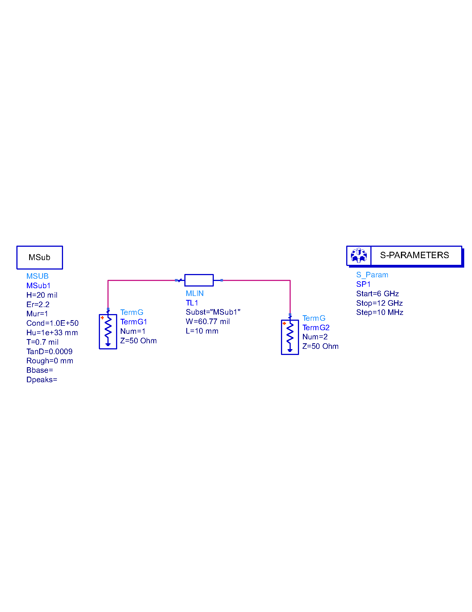 | Schematic of the 50 Ω microstrip line on the RT5880 substrate |
|  | S11 result of the 50 Ω line validation test |

### Smith Chart Synthesis

| Result | Description |
| :---- | :---- |
| 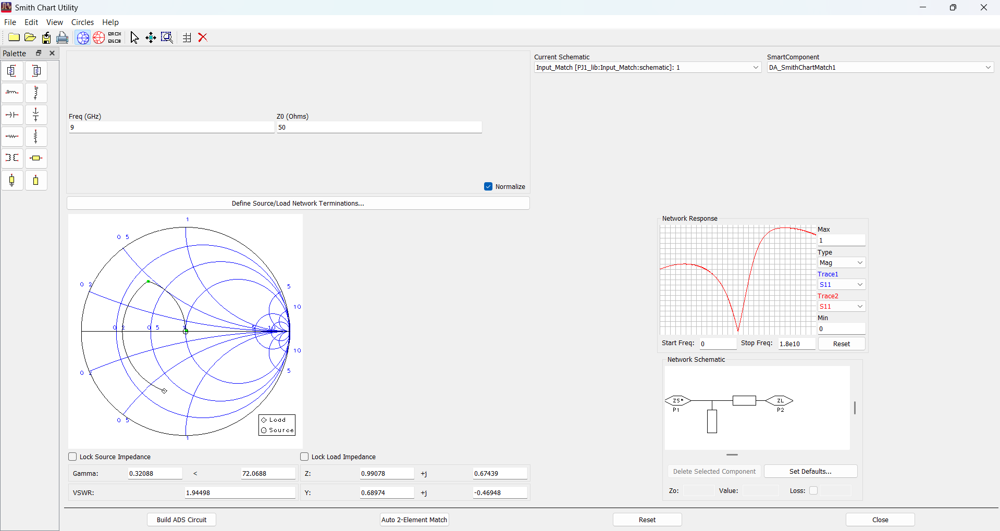 | Smith Chart synthesis of the input matching network |
| 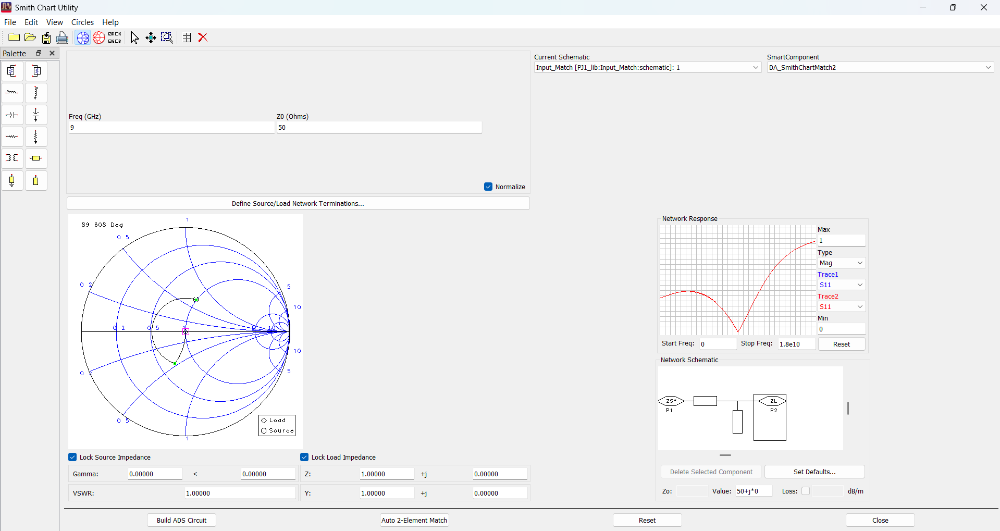 | Smith Chart synthesis of the output matching network |

### Ideal Transmission-Line Design

| Result | Description |
| :---- | :---- |
| 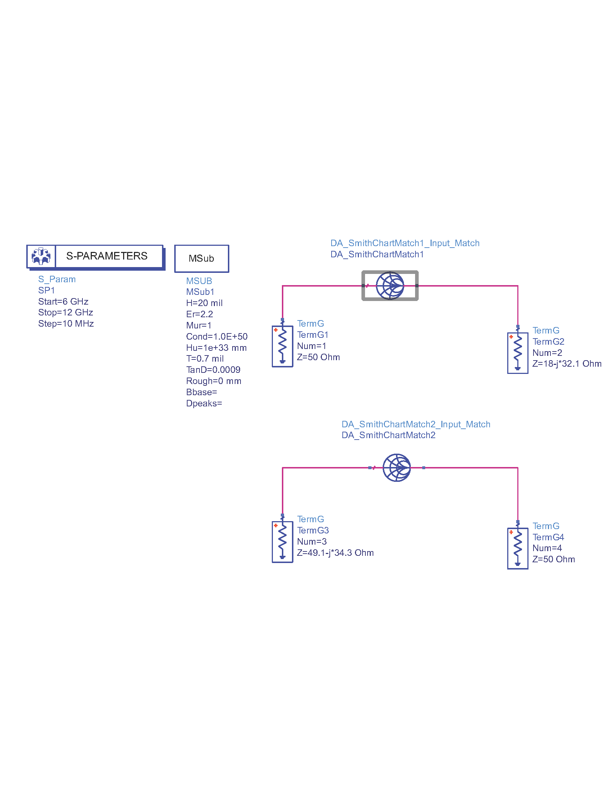 | Ideal transmission-line schematic (Smith Chart SmartComponent blocks) |
| 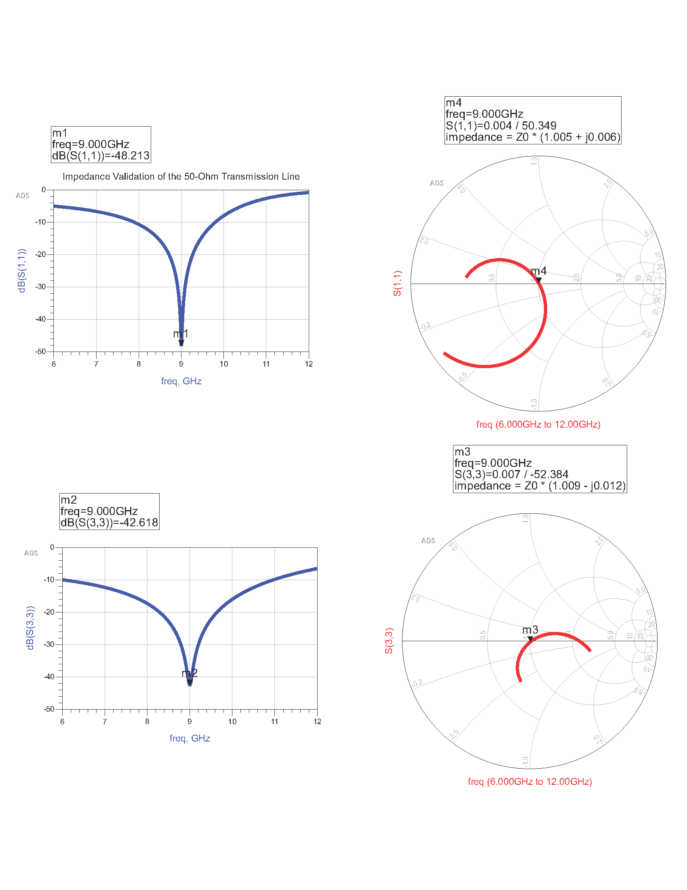 | S11/S33 result and Smith chart of the ideal transmission-line design |

### Microstrip Realization (MLIN/MLOC)

| Result | Description |
| :---- | :---- |
| 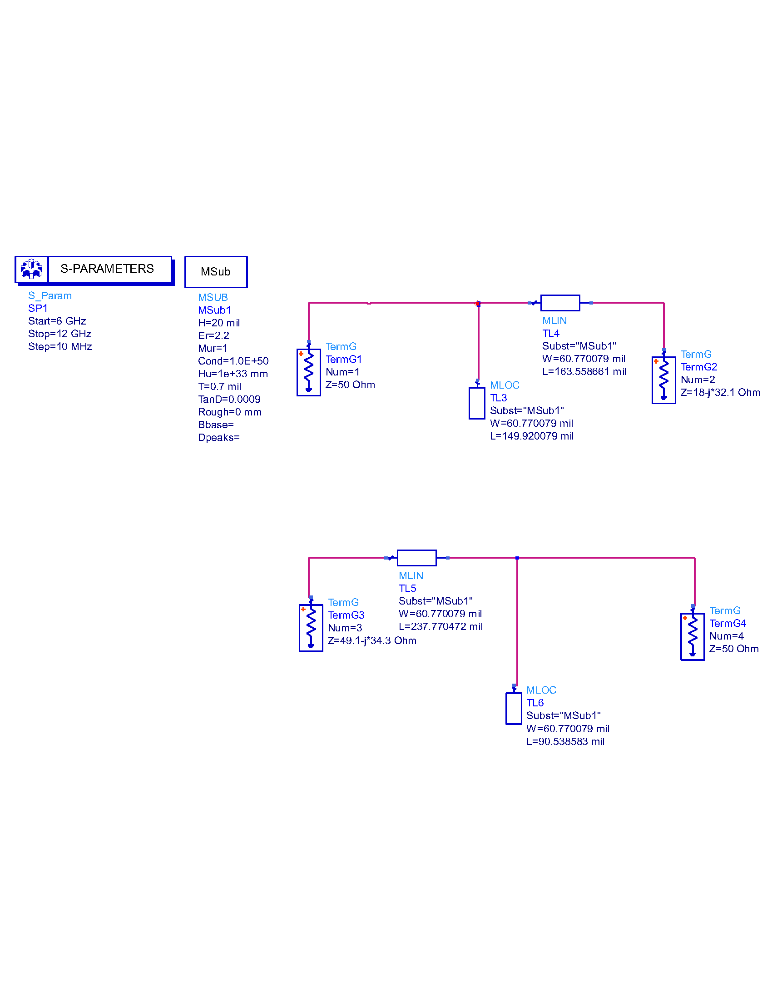 | Microstrip schematic (MLIN/MLOC elements) |
| 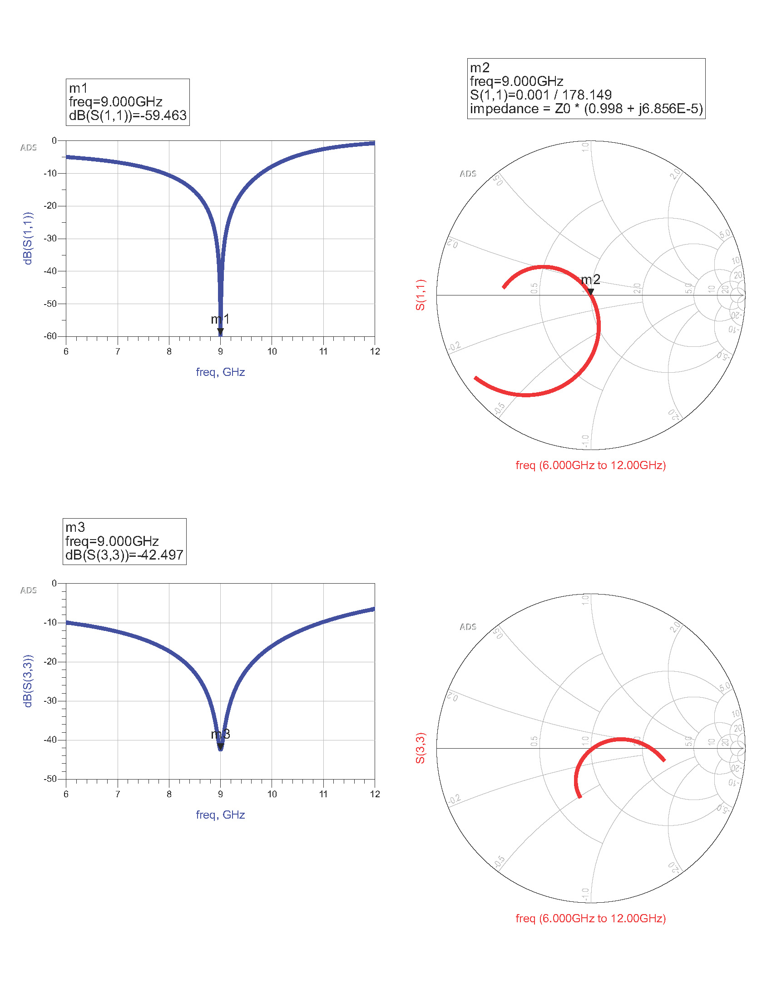 | S11/S33 result and Smith chart of the microstrip realization |

### Final Schematic with MTEE T-Junctions

| Result | Description |
| :---- | :---- |
| 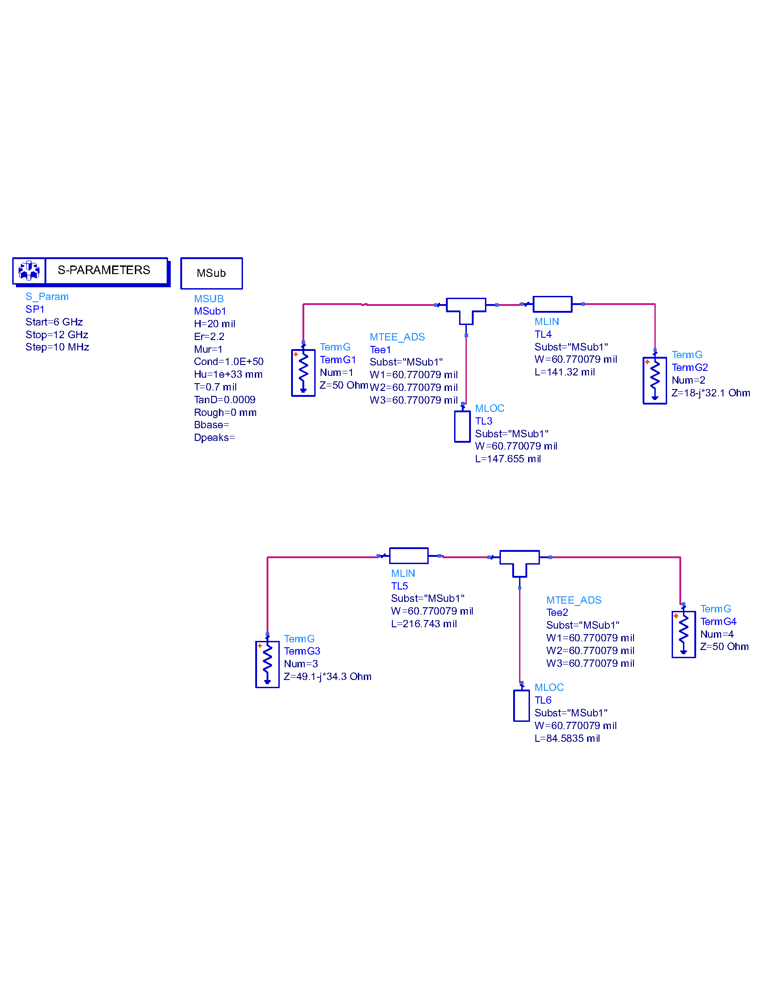 | Final optimized schematic with MTEE T-junction components |

### Momentum Full-Wave Simulation

| Result | Description |
| :---- | :---- |
| 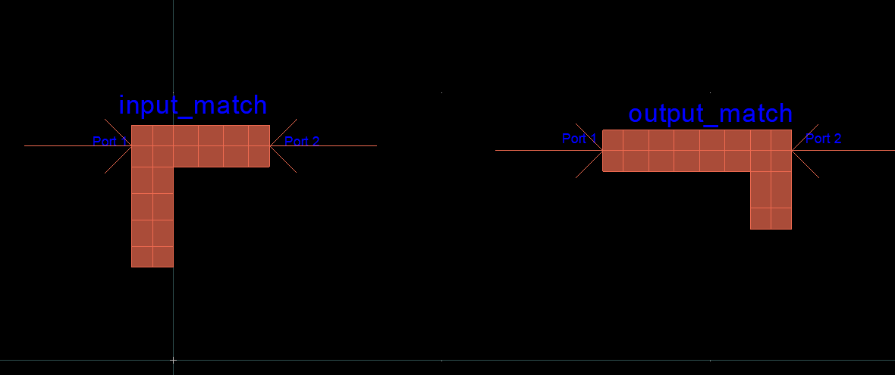 | 2D view of the matching networks in the Layout environment |
| 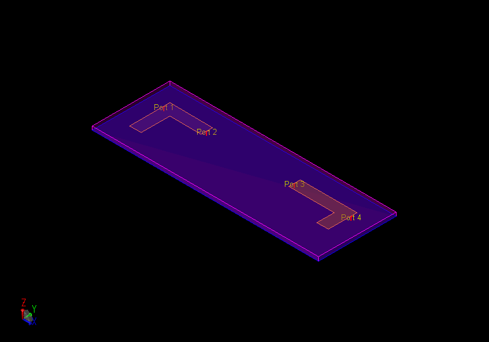 | 3D layout view of the combined input and output matching networks |
| 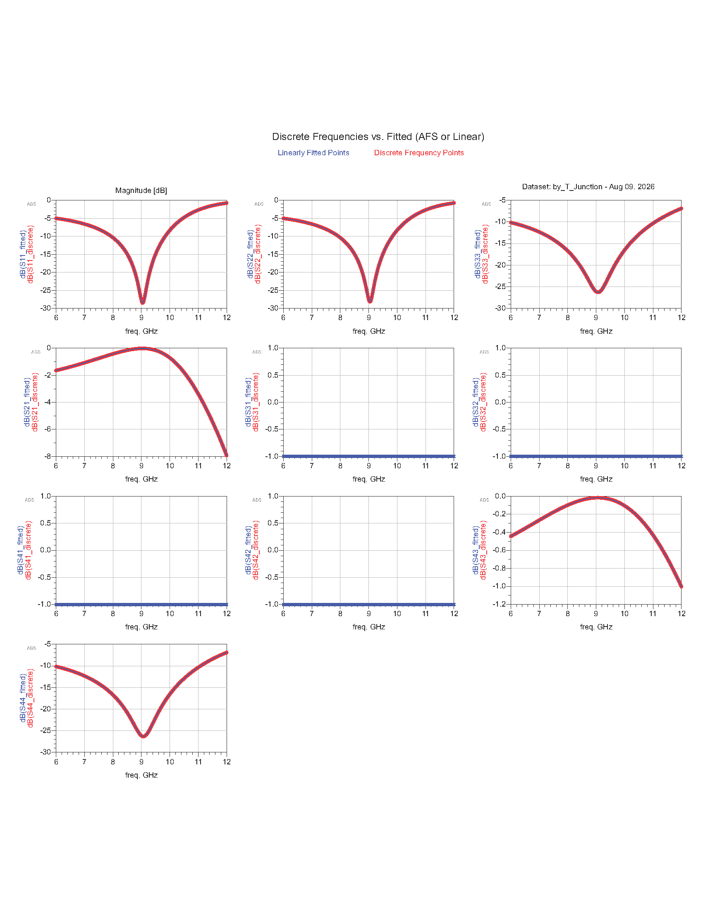 | Momentum S-parameters magnitude result vs. frequency |
| 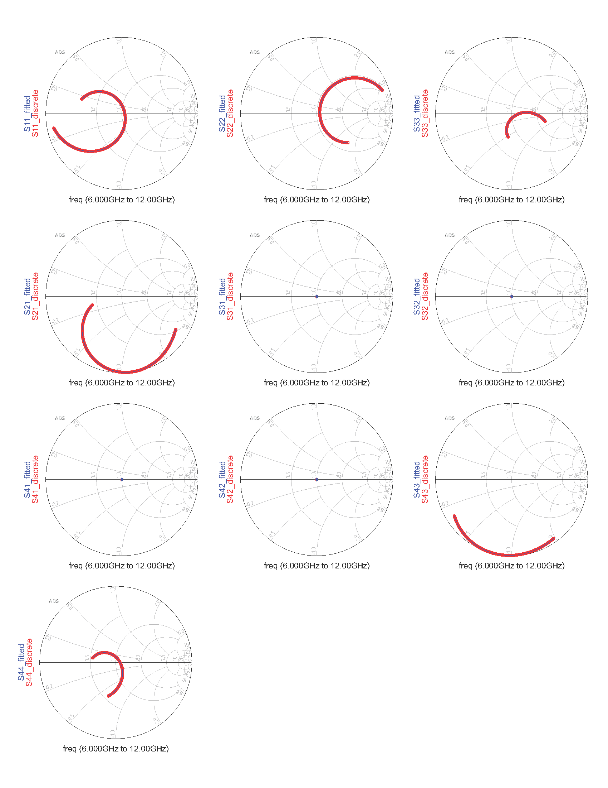 | Momentum result on the Smith Chart |

*The full report (`Report/HW1_Sim__FW_ADS_4042.pdf`) contains all result plots and additional discussion.*

## How to Run

1. Download the archived workspace file `PJ1_wrk.7zads` from the `ADS_Workspace` directory.
2. Open Keysight Advanced Design System (ADS).
3. Go to the top menu and click **File > Unarchive Workspace...**
4. Select the downloaded `PJ1_wrk.7zads` file as the source.
5. Select a destination directory for the extracted workspace.
6. Click **Unarchive**. ADS extracts and opens the project automatically.
